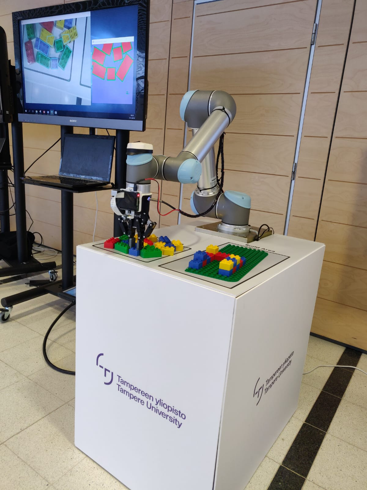
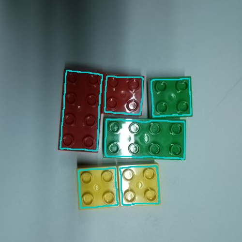
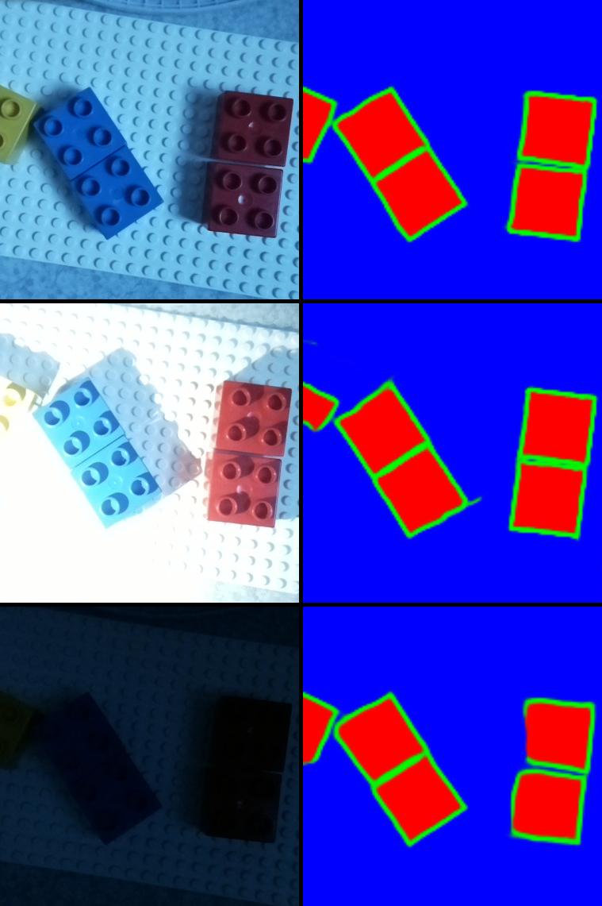

# BRICK ASSEMBLER ROBOT
Brick Assembler Robot is a 6-axis manipulator for building and deconstructing 
user-defined structures made of [Duplo](https://en.wikipedia.org/wiki/Lego_Duplo)
(Duplo are like Lego but twice the size). 
The robot can see using its especially affordable 
[Raspberry Pi](https://www.raspberrypi.org/products/raspberry-pi-3-model-b/) 
wrist camera. 
Deep learning (i.e. artificial intelligence) is utilized to achieve robust machine vision system under 
demanding lighting conditions as seen in figures 2 and 3. Models can be created 
using [LEGO Digital Designer](https://www.lego.com/en-us/ldd) or similar tool 
that exports LDraw files.

### Main features
* Build or deconstruct a structure made of 2x2 and 2x4 Duplo bricks with user-made LDraw model as a reference.
* Duplo detection using deep learning based machine vision.
* 3D-printable wrist camera mount and casing (for Raspberry Pi 3).
* 3D-printable gripper fingers for manipulating Duplo bricks.
* User assisted color calibration procedure.
* User assisted platform and camera calibration procedures.
* Minimal UR5 pendant configuration.

*Figure 1: Robot assembling during an event at Tampere-talo.*

 

*Figure 2: Duplo segmentation using neural network. Irregular cast shadows and strong 
highlights are not enough to make the segmentation fail.*

 

*Figure 3: Segmentation results in various lighting conditions. 
Images on the right are raw outputs from the neural network.*

 

### Requirements
* Universal Robot 5, sofware version 3.4 <= x < 4.0 (only 3.4 verified on a real system).
* Robotiq 2-Finger 85 Gripper.
* Raspberry Pi 3 and Camera Module V2.
* Router or a network switch.
* Windows or Linux PC with Python 3.6.
* 3D-printer for manufacturing camera fixture, Raspberry Pi casing and gripper fingers.

### Contributions
* **Tomi Sepponen** — System integration, machine vision and robot controller.
* **Julius Linkinen** — LDraw conversion to build instructions, head of communications.
* **Matiss Ziemulis** — 3D-design and manufacturing.
* **Andrei Lobov** — Project supervisor.

### Notes
If you plan on using or modifying the code see documents
in git branch "project-eval". It is outdated as some features 
(neural network and deconstruction) were not implemented back then, but still useful.
